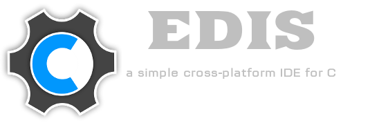

#Edis-IDE



Contenidos

1. [Qué es Edis?](#qúe-es-edis)
2. [Características](#características)
3. [Plataformas](#plataformas)
3. [Ejecutar Edis](#ejecución)
4. [Instalar Edis](#instalación)
5. [Pruebas de Software](#tests)
6. [Contribuir en el Proyecto](#contribuyendo)
7. [Licencia](#licencia)
8. [Donaciones](#donaciones)
9. [Autor](#autor)

## Qué es Edis?

**Edis** es un IDE (Entorno de Desarrollo Integrado) libre y multiplataforma para el lenguaje de programación C, desarrollado en Python y PyQt.

## Características

* **Resaltado de sintáxis**
* **Plegado de código**
* **Soporte para el manejo de proyectos**
* **Minimapa**
* **Selector de archivos**
* **Árbol de símbolos**
* **Autocompletado de código basado en el documento**
* **Autocompletado de `[]`, `{}`, `()`, `""`, `''`**
* **Autocompletado de llaves en funciones y estructuras**
* **Marcadores**
* **Banderas para el compilador: `-Werror`, `-Wfatal-errors`, `-O`, `-O2`, etc**
* **Comparte el código en Pastebin con `Ctrl+P`**
* **Combo en lugar de pestañas para seleccionar archivos abiertos**
* **Búsqueda y reemplazo de palabras en el código**
* ... Y más

## Plataformas

* GNU/Linux
* Windows

## Ejecución

###Prerequisitos

* [Python 3.x](https://www.python.org/downloads/release)
* [PyQt4](http://www.riverbankcomputing.co.uk/software/pyqt/intro)
* [QScintilla](http://www.riverbankcomputing.com/software/qscintilla/intro)
* [Ctags](http://ctags.sourceforge.net/)

Descarga el [código fuente](https://github.com/centaurialpha/edis/releases) o clona el repositorio:

```bash
git clone https://github.com/centaurialpha/edis.git
cd edis
python bin/edis
```

## Instalación

####Windows

Descarga el instalador de la última versión [desde acá](https://github.com/centaurialpha/edis/releases).

####GNU/Linux

Descarga el código fuente o clona el repositorio, dentro del directorio ejecuta:
```bash
sudo python setup.py install
```

## Tests

Para mantener la calidad del Software **Edis** posee tests que corren automáticamente a través de [Travis-CI](https://travis-ci.org/). El estado de la última construcción es el siguiente:

[](https://travis-ci.org/centaurialpha/edis)

## Contribuyendo

Para contribuir con el proyecto siga estas instrucciones: [Contribuyendo con Edis](https://github.com/centaurialpha/edis/blob/master/CONTRIBUTING.md).

## Licencia

**Edis** es Software Libre, distribuido bajo los términos de la [GPLv3+](http://gnu.org/licenses/gpl.html).

## Donaciones

Colabora con éste proyecto a través de [gratipay](https://gratipay.com/centaurialpha/)

[](https://gratipay.com/centaurialpha/)

## Autor

Gabriel Acosta

* e-mail: [acostadariogabriel@gmail.com](mailito:acostadariogabriel@gmail.com)
* web: [centaurialpha.github.io](http://centaurialpha.github.io)
* twitter: [@_alfacentauri](http://twitter.com/_alfacentauri)
