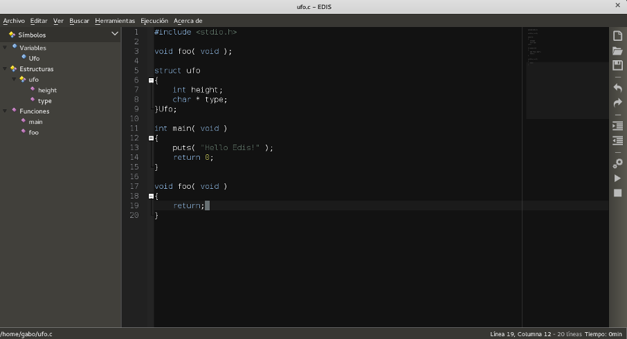

EDIS 
====
.. image:: https://img.shields.io/badge/Python-3-blue.svg?style=flat-square
     :target: https://python.org 
.. image:: https://img.shields.io/badge/PyQt-4-green.svg?style=flat-square
     :target: http://riverbankcomputing.co.uk/software/pyqt/intro 
.. image:: https://img.shields.io/badge/Licencia-GPLv3-red.svg?style=flat-square
     :target: http://gplv3.fsf.org
.. image:: https://img.shields.io/badge/build-passing-green.svg?style=flat-square

What is this?
-------------
Edis es un Entorno de Desarrollo Integrado (IDE) simple y ligero, está programado en Python y Qt. Edis se basa en la 
simplicidad: write, build and run!.

Awesome features
----------------

* **Syntax highlighter**
* **Code folding**
* **Minimap**
* **Highlighting words**
* **File selector**
* **Tree symbols**
