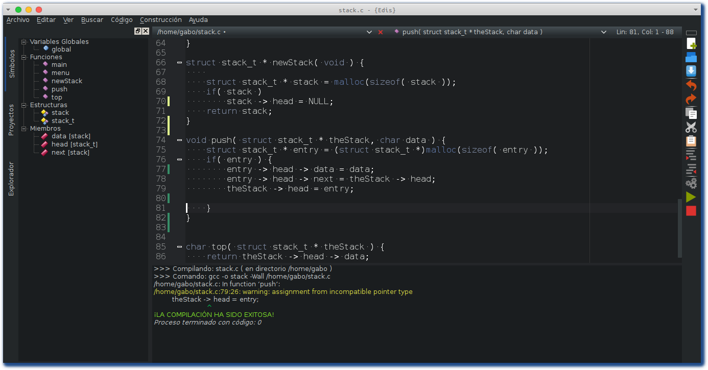

========
Edis-IDE
========

.. image:: ./src/images/sources/logo.png

.. Contents::
    :backlinks: none

.. sectnum::

What is this?
=============

**Edis** es un Entorno de Desarrollo Integrado (IDE) para el lenguaje de programación C, simple y ligero, está programado en Python y Qt. Edis se basa en la 
simplicidad: *write, build and run!*.

Awesome features
================

* **Syntax highlighter**
* **Code folding**
* **Minimap**
* **Highlighting words**
* **Code style checker**
* **File selector**
* **Tree symbols**
* **Auto-completion of keywords**

Platforms
=========

* GNU/Linux
* Windows
* *Mac OS* (Aún no testeado)
     

Installing and running
======================

Prerequisites
-------------

* `Python <https://python.org>`_ 3.x
* `PyQt4 <http://www.riverbankcomputing.co.uk/software/pyqt/intro>`_ >= 4.8
* `QScintilla2 <http://www.riverbankcomputing.com/software/qscintilla/intro>`_

Easy install
------------

*GNU/Linux:*

Descargar código fuente desde `acá <https://github.com/centaurialpha/edis/releases>`_ ó clona el repositorio:

::

   git clone https://github.com/centaurialpha/edis.git

Ahora puedes ejecutar **Edis**:

::

   cd edis
   python bin/edis
   
O instalar:

::

   sudo python setup.py install

*Windows:*

Los binarios se encuentran `acá <https://github.com/centaurialpha/edis/releases>`_

Tests status
============

**Edis** posee pruebas que corren automáticamente a través de `Travis CI <https://travis-ci.org>`_.
El estado actual es el siguiente:

.. image:: https://travis-ci.org/centaurialpha/edis.svg?branch=master
     :target: https://travis-ci.org/centaurialpha/edis

Contact
=======

* `Edis Web <http://centaurialpha.github.io/edis>`_
* `Lista de e-mail <http://groups.google.com/group/edis-ide/topics>`_

Contributing
============

Para contribuir con el proyecto por favor lee esto: `Contribuyendo con Edis <https://github.com/centaurialpha/edis/blob/master/CONTRIBUTING.md>`_.

License
=======

* **Edis** es ¡Software Libre! distribuido bajo los términos de la licencia `GPLv3+ <http://gnu.org/licenses/gpl.html>`_.
