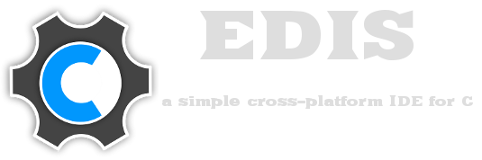

.. image:: https://img.shields.io/badge/Python-3-blue.svg?style=flat-square
     :target: https://python.org 
.. image:: https://img.shields.io/badge/PyQt-4-green.svg?style=flat-square
     :target: http://riverbankcomputing.co.uk/software/pyqt/intro 
.. image:: https://img.shields.io/badge/Licencia-GPLv3-red.svg?style=flat-square
     :target: http://gplv3.fsf.org
.. image:: https://img.shields.io/badge/build-passing-green.svg?style=flat-square

What is this?
-------------
**Edis** es un Entorno de Desarrollo Integrado (IDE) simple y ligero, está programado en Python y Qt. Edis se basa en la 
simplicidad: *write, build and run!*.

Awesome features
----------------
* **Syntax highlighter**
* **Code folding**
* **Minimap**
* **Highlighting words**
* **Errors checker**
* **File selector**
* **Tree symbols**
* **Auto-completion of keywords**

Platforms
---------
* GNU/Linux
* Windows

Dependencies
------------
Estas dependencias son necesarias para ejecutar Edis desde el código fuente.

* `Python <https://python.org>`_ 3.x
* `PyQt4 <http://www.riverbankcomputing.co.uk/software/pyqt/intro>`_ >= 4.8
* `QScintilla2 <http://www.riverbankcomputing.com/software/qscintilla/intro>`_

* **Opcional:**
     
  * `Ctags <http://ctags.sourceforge.net/>`_ *Necesario para crear el árbol de símbolos*
  * `Cppcheck <http://cppcheck.sourceforge.net/>`_ *Análisis estático de errores*
     
Install
-------
::

   sudo python setup.py install

Run Edis
--------
::

     git clone https://github.com/centaurialpha/edis.git
     cd edis
     ./edis

Contact
-------

* `Edis Web <http://centaurialpha.github.io/edis>`_
* `Lista de e-mail <http://groups.google.com/group/edis-ide/topics>`_
